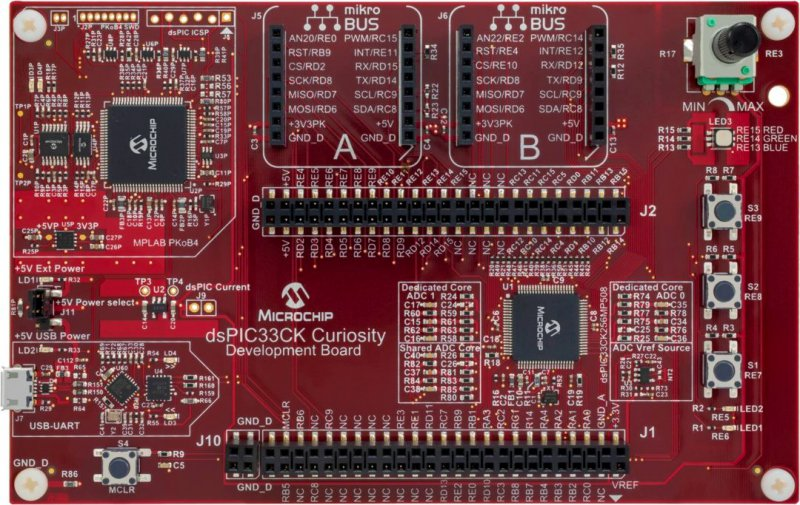
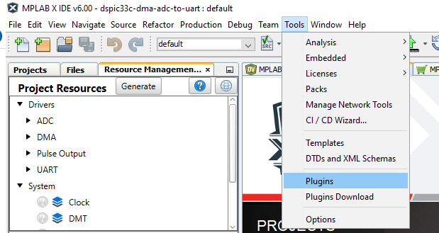
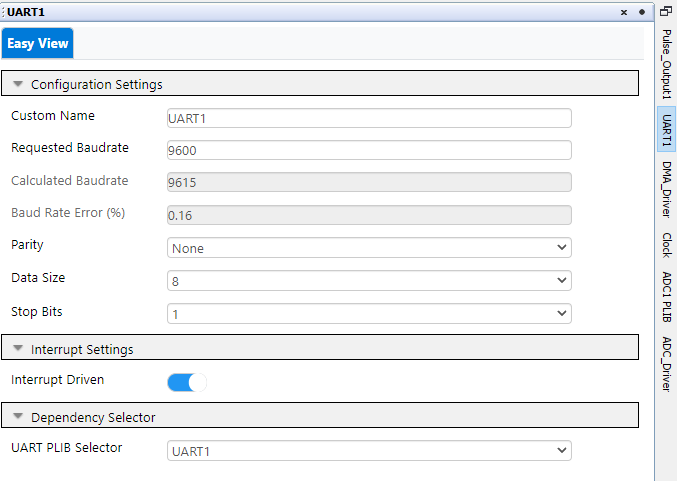
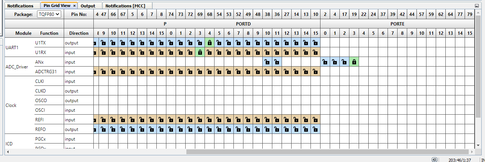
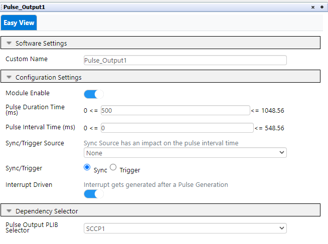
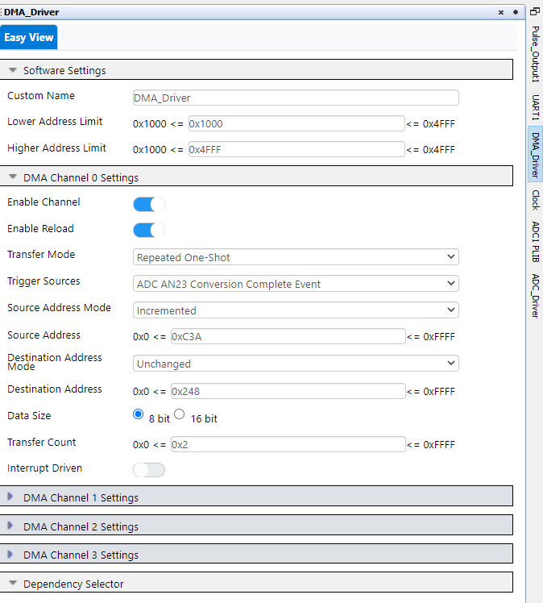
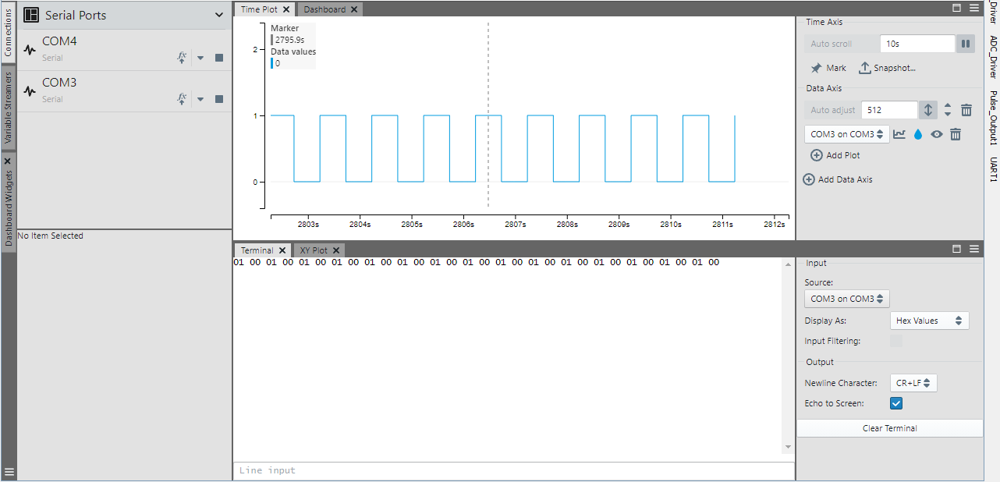
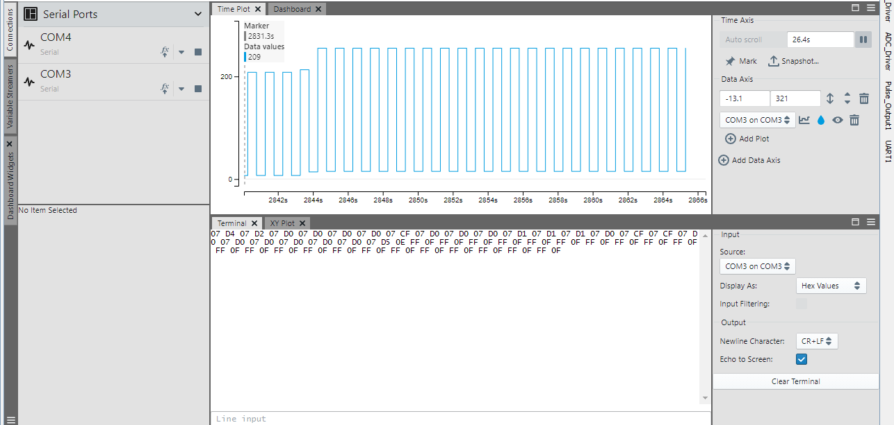

 

## DSPIC33C DMA ADC TO UART

## Summary

This project describes the usage of DMA for data transfer from ADC to UART(peripheral to peripheral communication) on dsPIC33CK Curiosity board using MPLAB® Code Configurator. 
The ADC is triggerred to start conversion every 500 ms using SCCP1 in Pulse Output Mode. Once the conversion is complete, DMA is triggerred by ADC to transfer conversion result 
from ADC buffer to UART transmit buffer. The result can be verified in MPLAB® Data Visualizer Terminal window

## Related Documentation

[dsPIC33CK256MP508 datasheet](https://www.microchip.com/dsPIC33CK256MP508) for more information or specifications

## Software Used 

- [MPLAB® X IDE v6.00](https://www.microchip.com/mplabx) or newer
- [MPLAB® XC16 v2.00](https://www.microchip.com/xc16) or newer
- Device Family Pack : dsPIC33CK-MP_DFP v1.7.208
- [MPLAB® Code Configurator (MCC) 5.1.2](https://www.microchip.com/mcc) or newer
- [MPLAB® Data Visualizer v1.3.1160]

## Hardware Used

- [dsPIC33CK Curiosity Board](https://www.microchip.com/dm330030)

## Setup

**Hardware Setup**

- Connect a micro-USB cable to port `J7` of Curiosity board to USB port of PC

**MPLAB® X IDE Setup**

- Open the `dspic33c-dma-adc-to-uart.X` project in MPLAB® X IDE
- Build and program the device

**Data Visualizer Setup**

- To install Data Visualizer Plugin - Go to Tools, Click on Plugins, Download and install Data Visualizer Plugin

- Select MPLAB Data Visualizer in Available Plugins and install

## Operation

- The SCCP modules triggers the ADC for every configured timeout. On every trigger, the ADC conversion happens and DMA transfers data from ADC buffer to UART
- The conversion result is verified in n MPLAB® Data Visualizer.

## MCC settings for reference

This Project uses the driver code generated by **MCC-Melody**

### Configure MCC

1. Under **Device Resources** in left-hand pane
   1. Open the **Drivers** drop-down
   2. Double-click the **ADC**, **DMA** , **UART** and **Pulse Output** peripherals to add them your project
   
 and select trigger source option as SCCP1 Timer/OC/IC Event
   2. Enable the interrupt of the Channel 23
   3. **ADC Conversion** – Conversion occures every time a rising edge is detected from Pulse Output
   

3. In the **UART** window/tab
   1. Set **Baud Rate** to **9600**
   

4. In the **Pin Manager: Grid View** window
   1. UART1 U1TX --> RD4
   2. UART1 U1RX --> RD3 (Optional since we are just transmitting)

5. In the **Pulse Output** window/tab
   1. Set **Pulse duration time(ms)** to 500 
   2. Keep **Sync/Trigger** option as **Sync** for continuous triggering of ADC conversion. Also select **Interrupt Driven** Enable
   

6. In the **DMA** window/tab
   1. Under **DMA Channel 0 Settings**
      1. Enable **Enable Channel**
	  2. Enable **Enable Reload**
	  3. **Transfer Mode** select as **Repeated One-Shot**
	  4. **Trigger Sources** select as **ADC AN23 Conversion Complete Event**
	  5. Set **Source Address Mode** as **Incremented**
	  6. Set **Source Address** as **0x03A** (Address of ADCBUF23)
	  7. Set **Destination Address Mode** as **Unchanged**
	  8. Set **Destination Address** as **0x248** (Address of U1TXREG)
	  9. Select **Data Size** as **8 bit**
	  10. Set **Transfer Count** as **0x2** as ADC Buffer has 16 bit data and U1TXREG can read one byte at a time

### ADC Conversion Result in Data Visualizer(DV)

1. Program the device and Open DV by clicking the icon in the toolbar 
   1. In DV Plugin select the Communication Port for Curiosity board, Click on Terminal View and select display values in hex format
   1. Set the Potentiometer to Min, Check the ADC Converted Output data in DV. The expected output will be 00 01 for 12 bit ADC
   
   2. Set the Potentiometer to Max, Check the ADC Converted output data in DV. The expected output will be nearer to 0F FF (close to 4095 in decimal)
    
   3. Varying the Potentiometer from Minimum to Maximum, Observe the ADC Converted Result in Data Visualizer
   