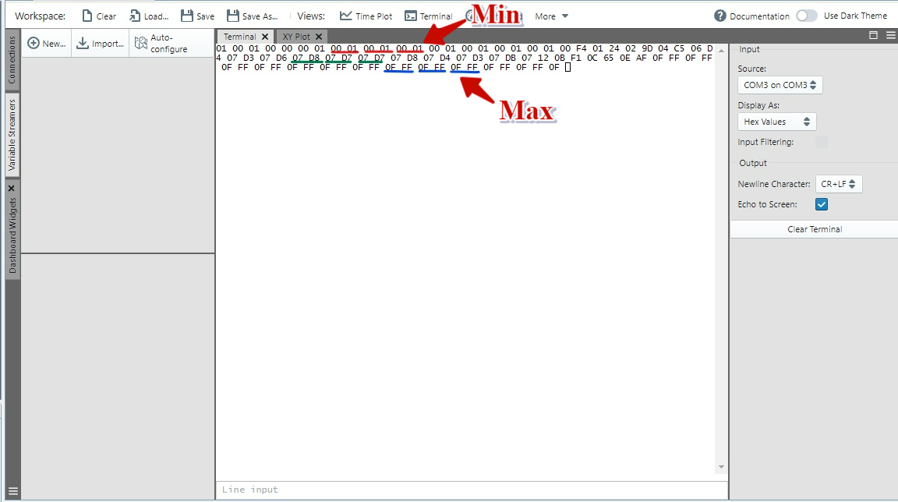

 

## dsPIC33C DMA ADC TO UART

## Summary

This project describes the usage of DMA for data transfer from ADC to UART on dsPIC33CK Curiosity board using MPLAB® Code Configurator. 
The ADC is triggered to start conversion every 500 ms using common software trigger in timer callback routine. Potentiometer input is given to ADC Channel, Once the ADC conversion is complete, DMA is triggered by ADC to transfer conversion count result 
from ADC buffer to UART transmit buffer. The result can be verified in MPLAB® Data Visualizer 

## Related Documentation

dsPIC33CK256MP508 datasheet (https://www.microchip.com/dsPIC33CK256MP508) for more information or specifications

## Software Used 

- MPLAB® X IDE v6.00 (https://www.microchip.com/mplabx) or newer
- MPLAB® XC16 v2.00 (https://www.microchip.com/xc16) or newer
- Device Family Pack: dsPIC33CK-MP_DFP v1.7.208
- MPLAB® Code Configurator (MCC) 5.1.2 (https://www.microchip.com/mcc) or newer
- MPLAB® Data Visualizer v1.3.1160 (https://www.microchip.com/mplabdatavisualizer) or newer

## Hardware Used

- dsPIC33CK Curiosity Board (https://www.microchip.com/dm330030)

## Setup

**Hardware Setup**

- Connect a micro-USB cable to port `J7` of Curiosity board to USB port of PC

**MPLAB® X IDE Setup**

- Open the `dspic33c-dma-adc-to-uart.X` project in MPLAB® X IDE
- Build and program the device

**Data Visualizer (DV) Setup**

1. In DV Plugin select the Communication Port for Curiosity board, Click on Terminal View and select display values in hex format (As 12-bit ADC is being configured, the conversion output will be in the range 0 to 4095). Refer the below image for DV Setup

## Operation

- Once Timer is initialized with periodic timeout event, for every Timeout event callback routine, Common Software trigger will trigger ADC Conversion and DMA will transfer data from ADC buffer to UART
- The conversion result is verified in Data visualizer terminal by varying the Potentiometer. For 12-bit ADC, the Converted ADC output counts will be in the range of 0 to 4095 in decimal
- Program the device and Open Data visualizer terminal, 
   1. Set the Potentiometer to Min, Check the ADC Converted Output data in the terminal. The expected output will be 00 01 for 12-bit ADC
   2. Set the Potentiometer to Max, Check the ADC Converted output data in the terminal. The expected output will be nearer to 0F FF (close to 4095 in decimal)
   3. Varying the Potentiometer from Minimum to Maximum, Observe the ADC Converted Result in DV terminal

## MCC settings for reference

This Project uses the driver code generated by **MCC-Melody**

1. Load the DMA driver from device resources, In the **DMA** window
   - Under **DMA Channel 0 Settings**
     1. Enable **Enable Channel**
	  2. Enable **Enable Reload**
	  3. **Transfer Mode** select as **Repeated One-Shot**
	  4. **Trigger Sources** select as **ADC AN23 Conversion Complete Event**
	  5. Set **Source Address Mode** as **Incremented**
	  6. Set **Destination Address Mode** as **Unchanged**
	  7. Select **Data Size** as **8 bit**
	  8. Set **Transfer Count** as **0x2** as ADC Buffer has 16-bit data and U1TXREG can read one byte at a time

2. Load the ADC driver from device resources, In **ADC** window
   1. Enable **Channel_AN23** (connected to Potentiometer of Curiosity board) and select trigger source option as **Common Software Trigger**
   2. Enable the interrupt of the Channel_AN23
   3. **ADC Conversion** – Conversion occurs every time when the timer timeout callback routine hits
   

3. Load the Timer driver from device resources, In the **Timer** window
   1. Set **Requested Timer Period(ms)** to 500

4. Load the UART driver from device resources, In the **UART** window
   1. Set **Baud Rate** to **9600** 
   

5. In the **Pin Manager: Grid View** window
   1. For UART1 U1TX - Configure the pin RD4
   2. For UART1 U1RX - Configure the pin RD3 (Optional since we are just transmitting)

